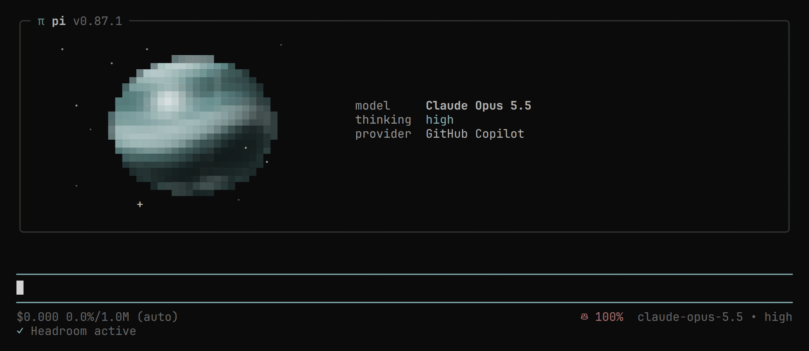

# Pi Agent Setup



## Install

```bash
git clone git@github.com:penrodlol/pi-setup.git ~/.pi
pi   # installs packages, then /login
```

The footer's provider icons need a [Nerd Font](https://www.nerdfonts.com/) v3.5.0+.
