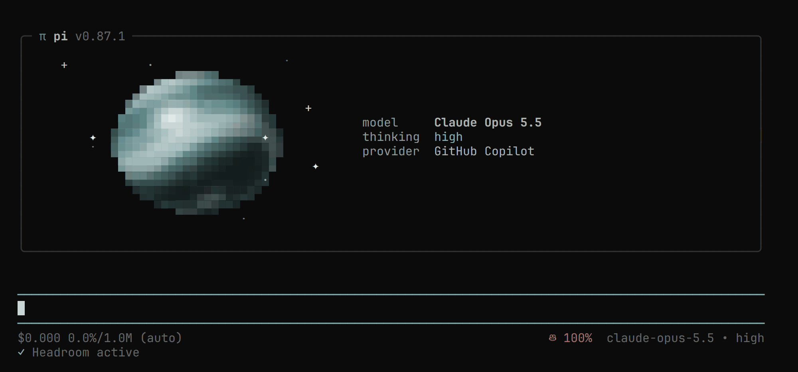

# Pi Agent Setup



## Install

```bash
git clone git@github.com:penrodlol/pi-setup.git ~/.pi && ~/.pi/install.sh
```

Then open a new shell, run `pi` and `/login`.

`install.sh` is safe to re-run and skips anything already installed: Node.js ≥ 22.19 (via nvm), pi and its packages, [qmd](https://github.com/tobi/qmd) (pi-memory search), uv + [headroom-ai](https://github.com/headroomlabs-ai/headroom) (noheadroom proxy), the JetBrainsMono [Nerd Font](https://www.nerdfonts.com/) (footer icons; set it as your terminal font), and optionally ffmpeg + yt-dlp (pi-web-access video). Use `--no-font` / `--no-optional` to skip those.
